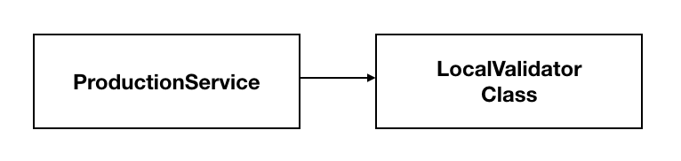
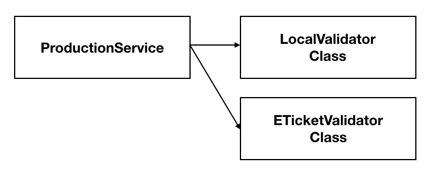
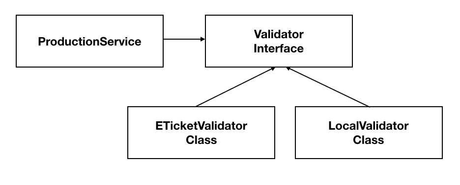

# 객체지향설계 5원칙 SOLID의 이해와 예제

## 목표

[SOLID](https://ko.wikipedia.org/wiki/SOLID_(%EA%B0%9D%EC%B2%B4_%EC%A7%80%ED%96%A5_%EC%84%A4%EA%B3%84))에 대한 설명을 하는 글은 여러 블로그에 소개가 되어있습니다.
하지만 대부분의 글이 개념적인 설명을 위주로 하고 있을뿐더러, 너무 추상적이라 이해하기 어렵다는 생각을 했습니다. 
그래서 저는 이 글을

- 실제로 코드상에서 어떠한 방식으로 적용되는지
- 어떻게 의식하고 코드를 작성하는 것이 SOLID를 지킬 수 있는지

이 두 가지에 중점을 두고, 개념적인 설명만 있는게 아닌 예제를 통해 SOLID를 공부하고 이해해 보고자 합니다.

글에서 사용된 예제는 모두 [GitHub](https://github.com/pci2676/post-for-blog/tree/master/CleanCodePost/solid)에 올라가 있습니다. 


### 1. SRP

Single Responsibility Principle - 단일 책임의 원칙

> **한 클래스는 하나의 책임을 가져야 한다.**


SRP가 지켜지지 않은 코드

```java
public class Production {

    private String name;
    private int price;

    public Production(String name, int price) {
        this.name = name;
        this.price = price;
    }

    public void updatePrice(int price) {
        this.price = price;
    }
}


public class ProductionUpdateService {

    public void update(Production production, int price) {
        //validate price
        validatePrice(price);

        //update price
        production.updatePrice(price);
    }

    private void validatePrice(int price) {
        if (price < 1000) {
            throw new IllegalArgumentException("최소가격은 1000원 이상입니다.");
        }
    }

}
```

상품의 역할을 하는 `Production` 과 상품의 가격을 변경하는 `ProductionUpdateService` 가 있습니다.
상품의 역할을 하는 `Production` 의 책임은

- update() : 상품의 정보를 변경하는 `Product`의 책임을 호출 한다.

상품의 업데이트를 하는 역할인 `ProductionUpdateService` 의 책임은

- updatePrice() : 상품의 가격을 변경한다.
- validatePrice() : 상품의 유효성을 검사한다.

입니다.

`ProductionUpdateService`의 역할은 `Product`의 내용을 변경하는 책임을 호출하는 책임을 가지고 있습니다.
즉, update()의 책임은 `ProductionUpdateService`의 책임으로 볼 수 있습니다.
하지만 가격의 유효성을 검증하는 validatePrice()는 `ProductionUpdateService` 의 책임이라고 볼 수 있을까요?
가격의 유효성을 검증하는 작업은 실제 가격의 정보를 바꾸는 `Product`의 책임으로 보는게 더 맞는것 같다고 생각합니다.
이를 토대로 유효성 검증이라는 책임을 `Product`로 옮긴 코드는 다음과 같습니다.


```java
public class Production {

    private static final int MINIMUM_PRICE = 1000;

    private String name;
    private int price;

    public Production(String name, int price) {
        this.name = name;
        this.price = price;
    }

    public void updatePrice(int price) {
        validatePrice(price);
        this.price = price;
    }

    private void validatePrice(int price) {
        if (price < MINIMUM_PRICE) {
            throw new IllegalArgumentException(String.format("최소가격은 %d원 이상입니다.", MINIMUM_PRICE));
        }
    }
}

public class ProductionUpdateService {

    public void update(Production production, int price) {
        //update price
        production.updatePrice(price);
    }

}
```

유효성 검증의 책임을 `Production`으로 옮김으로써 `ProductionUpdateService`는 온전히 상품의 정보를 변경하기 위한 코드만 존재하게 되었습니다.

이와같이 SRP를 지키기 위해서는 각 객체가 할 수 있는일과 해야 하는 일을 찾아 책임으로 부여하도록 의식해야 합니다.

다시말해 각 객체(`Product`)가 제어할 수 있는 정보(`price`)에 대한 책임(`validatePrice`)을 올바른 자리에 배치한다면 지킬 수 있는 규칙이라고 생각합니다.


### 2. OCP

Open Close Principle - 개방 폐쇄 원칙

> **소프트웨어 요소는 확장에는 열려 있으나 변경에는 닫혀 있어야 한다.**


상품 객체의 구조

```java
public class Production {
    private String name;
    private int price;
    // N(일반) ,E(전자티켓) ,L(지역상품)...
    private String option;

    public Production(String name, int price, String option) {
        this.name = name;
        this.price = price;
        this.option = option;
    }

    public int getNameLength() {
        return name.length();
    }

    public String getOption() {
        return option;
    }
}
```

상품객체에 `option` 이라는 멤버 변수가 생겼습니다.
`option` 에 따른 검증 작업을 진행해야하는 요구사항이 존재한다고 가정 후 코드를 작성했다고 합시다.


**요구사항**

- 일반 상품(N) 이름의 길이는 3글자 보다 길어야 합니다. 


OCP 원칙을 고려하지 않은 코드

```java
public class ProductionValidator {
    public void validateProduction(Production production) throws IllegalAccessException {
        if (production.getNameLength() < 3) {
            throw new IllegalAccessException("일반 상품의 이름은 3글자보다 길어야 합니다.");
        }
    }
}
```

이 상황에서는 문제가 없어 보이지만 다음과 같은 요구사항이 추가되었다면 어떻게 될까요?


**추가 요구사항**

- 전자 티켓(E) 이름의 길이는 10글자 보다 길어야 합니다.
- 지역 상품(L) 이름의 길이는 20글자보다 길어야 합니다.


현재 구조를 유지한다면 다음과 같이 코드를 작성하게 될것 같습니다.

```java
public class ProductionValidator {
    public void validateProduction(Production production) throws IllegalArgumentException {

        if (production.getOption().equals("N")) {
            if (production.getNameLength() < 3) {
                throw new IllegalArgumentException("일반 상품의 이름은 3글자보다 길어야 합니다.");
            }
        } else if (production.getOption().equals("E")) {
            if (production.getNameLength() < 10) {
                throw new IllegalArgumentException("전자티켓 상품의 이름은 10글자보다 길어야 합니다.");
            }
        } else if (production.getOption().equals("L")) {
            if (production.getNameLength() < 20) {
                throw new IllegalArgumentException("지역 상품의 이름은 20글자보다 길어야 합니다.");
            }
        }

    }
}
```

이러한 구조에서 아래와 같은 요구사항을 받게된다면..??

- 상품의 옵션이 계속해서 추가되고
  - 기존 옵션에 대한 검증 작업이 추가
  - 기존 옵션에 대한 검증 작업이 변경
  - 기존 옵션에 대한 검증 작업이 삭제
  - 기존 옵션에 대한 검증 작업이 통합

코드의 수정이 빈번하게 일어나고 `if...else if` 의 향연이 눈앞에 펼쳐질 것 같습니다!
유지보수가 하기 힘들어지고 코드를 파악하기 힘들어 질것입니다.
다시말해 변경에 너무 취약한 구조를 가지고 있습니다.


여기서 OCP를 지키는 구조를 취하게 해본다면 다음과 같이 변할 것 같습니다.

```java
public interface Validator {

    boolean support(Production production);

    void validate(Production production) throws IllegalArgumentException;

}
```

먼저 검증 작업에 대한 책임을 담당할 인터페이스를 작성하고!


```java
public class DefaultValidator implements Validator {
    @Override
    public boolean support(Production production) {
        return production.getOption().equals("N");
    }

    @Override
    public void validate(Production production) throws IllegalArgumentException {
        if (production.getNameLength() < 3) {
            throw new IllegalArgumentException("일반 상품의 이름은 3글자보다 길어야 합니다.");
        }
    }
}


public class ETicketValidator implements Validator {
    @Override
    public boolean support(Production production) {
        return production.getOption().equals("E");
    }

    @Override
    public void validate(Production production) throws IllegalArgumentException {
        if (production.getNameLength() < 10) {
            throw new IllegalArgumentException("전자티켓 상품의 이름은 10글자보다 길어야 합니다.");
        }
    }
}

public class LocalValidator implements Validator {
    @Override
    public boolean support(Production production) {
        return production.getOption().equals("L");
    }

    @Override
    public void validate(Production production) throws IllegalArgumentException {
        if (production.getNameLength() < 20) {
            throw new IllegalArgumentException("지역 상품의 이름은 20글자보다 길어야 합니다.");
        }
    }
}

```

위와 같이 옵션에 대한 검증 작업을 담당하게 할 `Validator`를 구현한다면!


```java
public class ProductValidator {

    private final List<Validator> validators = Arrays.asList(new DefaultValidator(), new ETicketValidator(), new LocalValidator());

    public void validate(Production production) {
        Validator productionValidator = new DefaultValidator();

        for (Validator localValidator : validators) {
            if (localValidator.support(production)) {
                productionValidator = localValidator;
                break;
            }
        }

        productionValidator.validate(production);
    }
}
```

위와 같은 코드가 작성될 수 있을 것 입니다.
이러한 구조에서 새로운 옵션이 생성되어 검증 로직이 추가되야 할 때
OCP를 지키지 않은 구조와 달리 `ProductValidator` 의 `validate()` 의 수정 없이
해당 검증을 담당할 객체를  추가하여 요구사항을 충족시킬 수 있습니다.

따라서 코드의 변경 없이 확장 가능한 구조가 되었습니다.

> 위 코드는 enum과 stream을 통해 더 간결해 질 수 있습니다.
> 주변 친구들이 enum과 stream을 잘 이해하지 못하는 모습을 보고 사용하지 않았습니다.
> enum을 사용한다면 어떻게 더 간결해 질 수 있는지 공부하면 좋을 것 같습니다.


OCP를 지키지 않은 구조에서 `ProductValidator` 가 너무 하는 일이 많았습니다.
달리 말해 가지고 있는 책임이 너무 많았다고 할수 있을것 같습니다.
어떤 객체의 책임이 너무 무겁지 않은지 의심하고,
SRP를 지키는 것 처럼 책임을 분리하는 작업을 통해 OCP를 지킬 수 있을 것 같습니다.


### 3. LSP

Liskov Substitution Principle - 리스코프 치환 원칙

> "프로그램의 객체는 프로그램의 정확성을 깨뜨리지 않으면서 하위 타입의 인스턴스로 바꿀 수 있어야 한다."

하위타입의 객체를 상위타입으로 업캐스팅 했을 때 문제없이 작동하면 되는건가? 라고 생각했습니다.  
하지만 가장 중요한 점은 상위 객체의 메소드(**책임**)가 예상한 대로 작동해야하는 것이라 생각합니다.  
이 말은 그저 오버라이딩 한 메소드가 컴파일 에러 없이 작동한다는 것이 아닙니다.  
클라이언트 쪽에서 객체에게 바라는 책임을 호출할 때 예상되는 동작을 해야한다는 것입니다.  

즉, LSP는 객체의 IS-A 관계를 만족하는 것이 아닌 객체의 **행위의 IS-A**를 만족해야합니다.

사각형의 넓이를 구하는 공식은 높이 곱하기 폭입니다. 그리고 이는 일반적인 책임입니다.  
하지만 정사각형의 넓이를 구하는 공식은 높이 곱하기 높이도 되고 폭 곱하기 폭도 되듯 높이와 폭의 차이가 없습니다.  
정사각형의 넓이를 구하는 공식은 사각형의 넓이를 구하는 공식은 본질적으로는 같으나 비본질적으론 다릅니다.  
LSP의 유명한 예제인 사각형 예제가 이를 설명하기 위함이라고 생각합니다.

> 이 [글](https://vandbt.tistory.com/41)이 추상적인 내용을 잘 설명하고 있다고 생각하여 링크를 걸어두겠습니다.

그리고 LSP를 공부하다보면 OCP와 무엇이 다른지 혼동되던 때가 있습니다.
둘이 굉장히 닮이 있는 모습을 느꼈는데, 이는 OCP의 기반이 되는 설계의 법칙이 LSP를 충족하고 있기 때문입니다.  
따라서 OCP가 만족이 되려면 LSP는 만족이 되어있다고 생각하면 될 것 같습니다.

LSP는 따로 예제를 준비하지 못 했습니다.  
개념이 어렵기도 하고 사각형만큼 적절한 예시가 생각나지 않습니다.  
추후 적절한 설명을 할 수 있는 예제가 생각나면 업데이트 하도록 하겠습니다.


### 4. ISP

Interface segregation principle - 인터페이스 분리 원칙

> "특정 클라이언트를 위한 인터페이스 여러 개가 범용 인터페이스 하나보다 낫다."

특정 클라이언트가 의미하는 것은 어떤 객체를 사용하려할 때, 그 객체의 일부 기능만을 사용하는 클라이언트를 의미한다고 볼수 있습니다.  
따라서 특정 클라이언트는 일부 기능 이외는 사용하지 않기 때문에 이외의 기능에 대해 알고 있을 필요가 없습니다.  
ISP를 설명하기에 적절한 예제로 다양한 기능을 가지고 있는 복합기 만한 것이 없는것 같습니다.  

복합기는 여러가지 기능을 가지고 있습니다.  
여기서는 인쇄, 복사, 팩스 기능을 가지고 있는 복합기가 있다고 가정해보겠습니다.  
아래는 복합기의 기능을 가지고 있는 인터페이스 입니다.

```java
public interface AllInOneDevice {
    void print();

    void copy();

    void fax();
}
```

그리고 복합기 객체를 위 인터페이스를 이용하여 구현하면 다음과 같습니다.  

```java
public class SmartMachine implements AllInOneDevice {
    @Override
    public void print() {
        System.out.println("print");
    }

    @Override
    public void copy() {
        System.out.println("copy");
    }

    @Override
    public void fax() {
        System.out.println("fax");
    }
}
```

복합기는 인터페이스에 정의된 기능을 모두 수행할 필요가 있기에 내부에 메소드가 구현이 되어있습니다.  
하지만 인쇄 기능만 있으면 되는 인쇄기를 위에 정의된 인터페이스를 이용하여 구현한다면 다음과 같이 될 것입니다.  

```java
package solid.isp.before;

public class PrinterMachine implements AllInOneDevice {
    @Override
    public void print() {
        System.out.println("print");
    }

    @Override
    public void copy() {
        throw new UnsupportedOperationException();
    }

    @Override
    public void fax() {
        throw new UnsupportedOperationException();
    }
}
```

보시다시피 인쇄의 역할을 담당하는 print는 override되었지만 나머지 기능은 구현할 필요가 없기 때문에  
`UnsupportedOperationException` 를 발생시키고 있습니다.  
이런 경우, 인터페이스만 알고 있는 클라이언트는 printer에서 copy기능이 구현되어 있는지 안되어있는지 모르기 때문에  
예상치 못한 오류를 만날 수 있습니다.

이렇게 구현된 객체는 자신에게 필요없는 책임(copy, fax)를 가지고 있습니다.  
SOLID의 첫번째 원칙인 SRP도 어기고 있는것을 확인할 수 있습니다.  
해결책은 ISP의 이름에도 나와 있듯 **하나**의 인터페이스를 **분리**하여 **여러개**의 인터페이스로 나누는 것입니다.

`AllInOneDevice` 를 나누면 다음과 같이 3개의 인터페이스로 나눌수 있습니다.

```java
public interface PrinterDevice {
    void print();
}

public interface CopyDevice {
    void copy();
}

public interface FaxDevice {
    void fax();
}
```

그리고 복합기가 필요하다면 다음과 같이 3개의 인터페이스를 전부 구현해 주면됩니다.

```java
public class SmartMachine implements PrinterDevice, CopyDevice, FaxDevice {
    @Override
    public void print() {
        System.out.println("print");
    }

    @Override
    public void copy() {
        System.out.println("copy");
    }

    @Override
    public void fax() {
        System.out.println("fax");
    }
}
```

마찬가지로 특정 기능만을 필요로 하는 객체가 있다면

1. 필요한 인터페이스만 이용하여 구현을 한다.
2.  `SmartMachine` 을 해당 인터페이스로 업캐스팅한다.

인쇄 기능만을 클라이언트에게 노출시키고 싶다면 다음과 같이 할수 있을 것 같습니다.

1-1. 필요한 인터페이스만 이용하여 구현

```java
		// 구현한 객체
		public class PrinterMachine implements PrinterDevice {
 		   @Override
 		 	 public void print() {
 	   	    System.out.println("print");
		   }
		}

		// 클라이언트가 사용할 경우
    @DisplayName("하나의 기능만을 필요로 한다면 하나의 인터페이스만 구현하도록 하자")
    @Test
    void singleInterface() {
        PrinterDevice printer = new SmartMachine();

        printer.print();
    }
```

1-2. `SmartMachine` 을 해당 인터페이스로 제공

```java
    @DisplayName("특정 기능만 클라이언트에게 노출시킬수 있다.")
    @Test
    public void singleFunction() {
        PrinterDevice printer = new SmartMachine();

        printer.print();
    }
```

ISP는 SRP를 지키려 의식하며 코드를 작성한다면 같이 지켜지는 법칙이라 생각합니다.


### 5. DIP

Dependency Inversion Principle - 의존관계 역전 원칙

> 추상화에 의존해야지, 구체화에 의존하면 안된다.


DIP가 지켜지지 않은 코드

```java
public class ProductionService {

    private final LocalValidator localValidator;

    public ProductionService(LocalValidator localValidator) {
        this.localValidator = localValidator;
    }

    public void validate(Production production) {
        localValidator.validate(production);
    }

}

public class LocalValidator {

    public void validate(Production production) {
        //validate
    }
}
```

위 코드는 아래와 같은 구조를 취하고 있습니다.



ProductionService가 LocalValidator에게 의존하고 있는 구조입니다.  
앞에서 다뤘던 OCP가 생각나지 않나요?  
이전처럼 추가적인 Validator를 추가가 된다면 다음과 같아질것 입니다!

```java
// 이 친구가 추가되면서
public class ETicketValidator {
    public void validate(Production production) {
        //validate
    }
}

// 서비스가 가지게되는 의존성이 늘어나게 된다!
public class ProductionService {

    private final LocalValidator localValidator;
    private final ETicketValidator eTicketValidator;

    public ProductionService(LocalValidator localValidator, ETicketValidator eTicketValidator) {
        this.localValidator = localValidator;
        this.eTicketValidator = eTicketValidator;
    }

    public void validate(Production production) {
        if (production.getType().equals("L")) {
            localValidator.validate(production);
        } else if (production.getType().equals("E")) {
            eTicketValidator.validate(production);
        }

    }

}
```

그리고 구조는 이렇게 됩니다!



Service 코드가 if...else if 가 늘어나게 되는 구조.. OCP에서 보지 않았나요?  
이제 DIP에서 인터페이스를 의존하라고 하였으니 그렇게 구현하도록 합니다!

```java
public interface Validator {
    void validate(Production production);
}

public class LocalValidator implements Validator {
    @Override
    public void validate(Production production) {
        //validate
    }
}

public class ETicketValidator implements Validator {
    @Override
    public void validate(Production production) {
        //validate
    }
}

public class ProductionService {

    private final Validator validator;

    public ProductionService(Validator validator) {
        this.validator = validator;
    }

    public void validate(Production production) {
        validator.validate(production);
    }
}
```

인터페이스가 생겼습니다!  
그리고 구조를 본다면 의존성의 방향이 거꾸로(역전) 흐르는것을 볼수 있습니다!



의존성이 역전됨으로써 ProductionService는 Validator의 구현체들로 부터 자유로워 졌고 코드의 변화도 없어지게 됩니다.  
OCP에서 얻은 이점과 같이 확장에는 열리게 되고 변경에는 닫힌 구조가 완성이 되었습니다!

한 클래스에 의존성이 너무 많이 있는지를 의심하고 그러한 구조를 개선하려 한다면 DIP를 준수하는 코드를 작성할 수 있을 것 같습니다.

## 맺으며

SOLID의 각 규칙들을 이론적으로만 알고 있었는데 직접 예제를 작성해가며 규칙을 적용해보니 각 규칙들이 독립적으로 존재하는 것이 아니라, 유기적으로 서로 연결이 되어있어 한 가지 규칙만 지켜지는 것이 아닌것을 알게되었습니다. 

예제를 머리로도 이해가 되고 가슴으로도 와닿는 예제를 작성하고 싶었는데 생각보다 너무 어려웠던것 같습니다..  
반드시 업데이트를 하도록 공부를 해야겠습니다.

객체지향의 핵심 개념이지만 인턴을 하며 본 코드에는 규칙들이 생각보다 잘 안 지켜지고 있는 모습을 봤습니다.  
그래서 코드의 유지보수가 힘들었고 코드를 따라가기가 매우 힘들었던 경험이 있습니다.  

이론에 대해 알고 넘어가는것이 아닌 적용할 수 있는 프로그래머가 되도록 노력해야 할 것 같습니다.