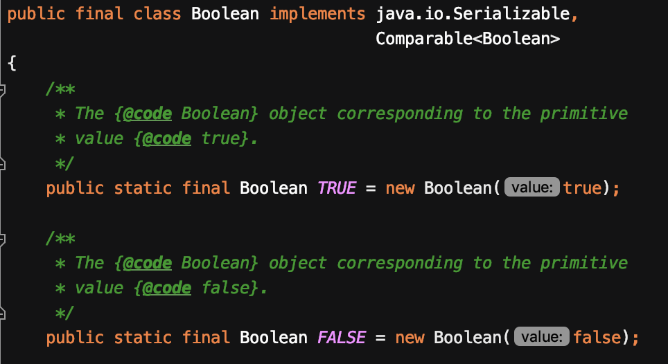
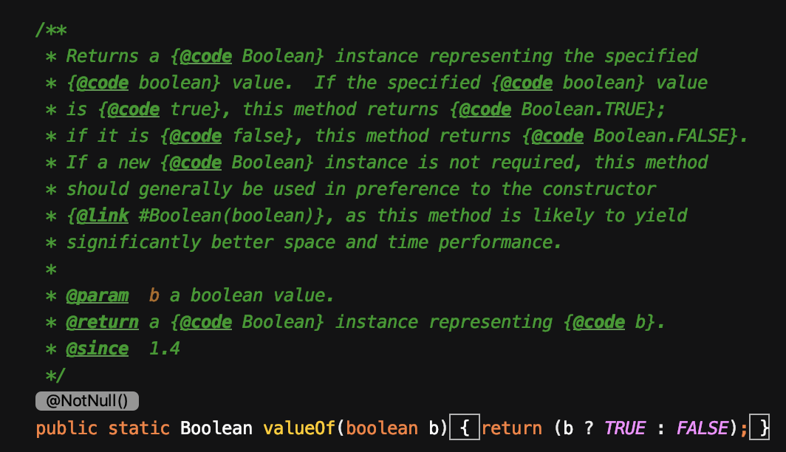
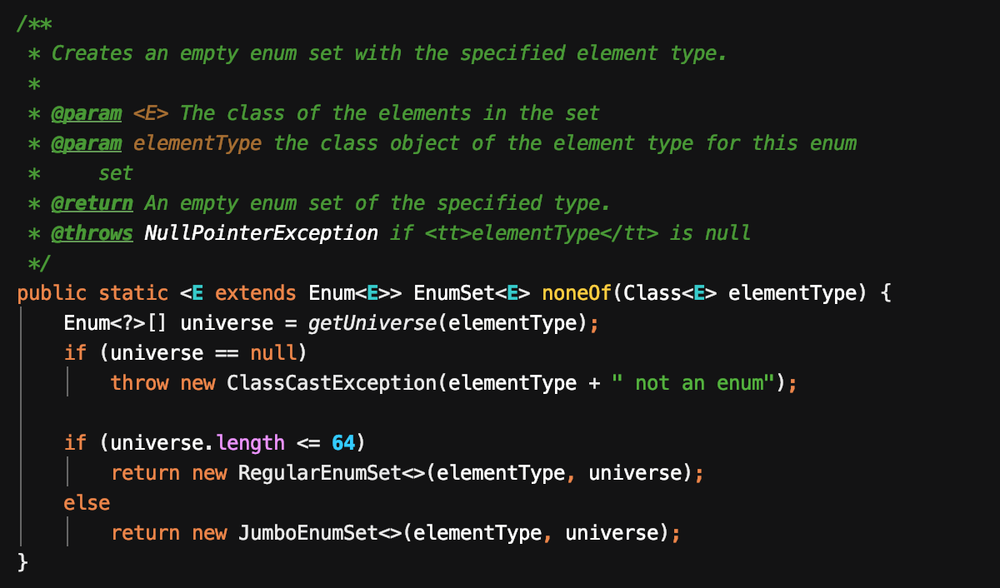
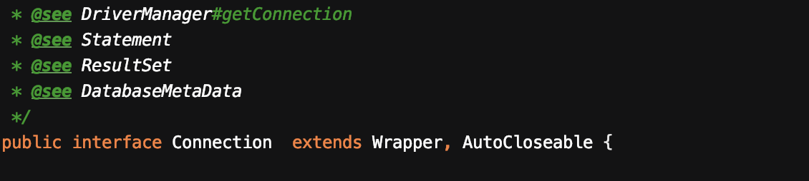
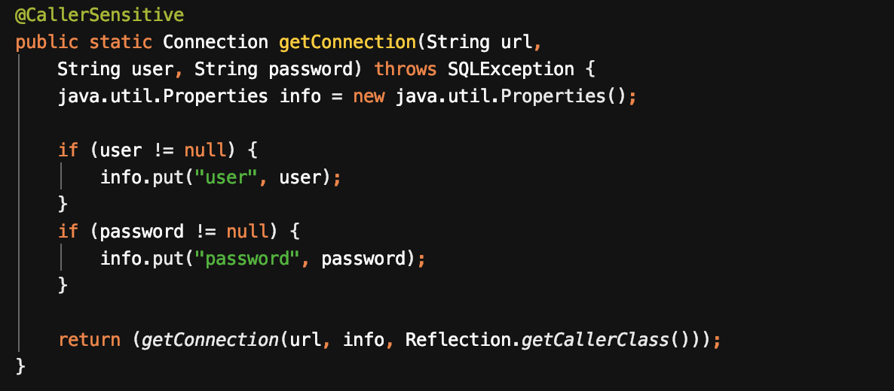

# 이펙티브 자바 2장 객체 생성과 파괴

## [아이템1] 생성자 대신 정적 팩터리 메서드를 고려하라

#### 첫번째 장점, **이름을 가질 수 있다.**

Example code.

```java
public class Ladder {
    public static Ladder left() {
        return new Ladder(Direction.LEFT);
    }

    public static Ladder right() {
        return new Ladder(Direction.RIGHT);
    }

    public static Ladder down() {
        return new Ladder(Direction.DOWN);
    }

    private Direction direction;

    public Ladder(Direction direction) {
        this.direction = direction;
    }

    enum Direction {
        LEFT,
        RIGHT,
        DOWN;
    }
}
```

단순히 생성자만 가지고 있다면 생성자에 들어가는 파라미터에 대한 정보를 알고 있어야 어떠한 객체가 형성되는지 파악할 수 있다.  
하지만 정적 팩터리 메서드를 이용한다면 위 코드의 `left`, `right`, `down` 과 같이 메서드의 이름만을 가지고 어떠한 객체가 생성되는지 한번에 파악할 수 있게 됨으로써 클라이언트가 알아야하는 정보가 줄어들게 할 수 있다.

#### 두 번째 장점, **호출될 때마다 인스턴스를 새로 생성하지 않아도 된다.**  

불변 클래스는 인스턴스를 미리 만들어 놓거나 새로 생성한 인스턴스를 캐싱하여 재활용하여 불필요한 객체 생성을 피할 수 있다.

불변 클래스 Boolean



Boolean의 팩터리 메서드 `of`



----

플라이 웨이트 패턴도 팩터리 메서드 패턴과 비슷한 기법이다.  

> 플라이 웨이트 패턴 : 공유할 수 있는 자원은 공유하는 패턴 /게임쪽에서 많이 사용되는 패턴이다.

#### 세 번째 장점, **반환 타입의 하위 타입 객체를 반환할 수 있는 능력이 있다.**

Example code.  

```java
public interface Type {
    static AType getAType() {
        return new AType();
    }

    static BType getBType() {
        return new BType();
    }
}

class AType implements Type {
}

class BType implements Type {
}
```

#### 네 번째 장점, **입력 매개변수에 따라 매번 다른 클래스의 객체를 반환할 수 있다.**

`universe.length` 의 값에 따라 `RegularEnumSet`, `JumboEnumSet` 을 반환한다.  
클라이언트는 EnumSet이 반환된다고 생각할 뿐 정확히 어떤 객체가 반환되는지 모르고 알 필요도 없다.



#### 다섯 번째 장점, 정적 팩터리 메서드를 작성하는 시점에는 반환할 객체의 클래스가 존재하지 않아도 된다.

jdbc의 예제에서 `Connection` 은 interface 이므로 구현체가 아니다. 하지만 `DriverManager.getConnection` 과 같이 구현체가 아님에도 정적 팩토리 메서드로 작성할 수 있다.  
이로 인해 구현체를 클라이언트의 입맛에 따라 반환하도록 정의할 수 있다.






#### 단점

1. 정적 팩토리 메서드만 제공한다면 private 생성자만 존재하기 때문에 protected, public한 생성자가 없어 상속을 통해 하위 클래스를 만들 수 없다.
2. 정적 팩토리 메서드만으로 어떠한 메서드가 인스턴스를 생성해주는지 명확하게 찾기가 힘들 수 있다.

