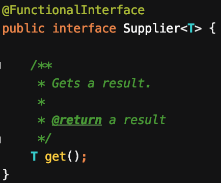

## 아이템 5 자원을 직접 명시하지 말고 의존 객체 주입을 사용하라

> 사용하는 자원에 따라 동작이 달라지는 클래스에는 정적 유틸리티 클래스나 싱글턴 방식이 적합하지 않다.  
> ...  
> 이 조건을 만족하는 간단한 패턴이 있으니, 인스턴스를 생성할 때 생성자에 필요한 자원을 넘겨주는 방식이다.

직접 명시되어 고정되어 있는 변수는 테스트를 하기 힘들게 만든다.  
즉, 의존성을 바깥으로 분리하여 외부로 부터 주입받도록 작성하여야 한다. (의존 객체 주입 패턴)

Example code

```java
public class PriceCalculateService {
    private static final String EXCHANGE_URL = "https://somewhere.com";
    private static final double FIXED_DISCOUNT_PRICE = 1000;

    private final ExchangeRateParser exchangeRateParser;

    public PriceCalculateService(ExchangeRateParser exchangeRateParser) {
        this.exchangeRateParser = exchangeRateParser;
    }

    public double discount(double price) {
        double exchangeRate = exchangeRateParser.getRate(EXCHANGE_URL);

        double exchangedDiscountPrice = FIXED_DISCOUNT_PRICE * exchangeRate;
        double exchangedPrice = price * exchangeRate;

        return exchangedPrice - exchangedDiscountPrice;
    }
}

interface ExchangeRateParser {
    double getRate(String url);
}

class RealExchangeRateParser implements ExchangeRateParser {
    @Override
    public double getRate(String url) {
        // ... 외부 의존성을 가지는 production code 가 위치한다 가정
        return 0;
    }
}

class MockExchangeRateParser implements ExchangeRateParser {
    @Override
    public double getRate(String url) {
        // 외부와 의존성을 가지지 않음. mock 용 코드
        return 1;
    }
}
```

`PriceCalculateService	` 의 `discount(double price)` 는 환율에 따라 1000원을 `price` 에서 차감하는 메소드이다.  
이 때 `ExchangeRateParser` 는 현재 환율의 정보를 가져오는 인터페이스라고 가정하고, 실제 서비스에서 `RealExchangeRateParser` 를 통해 url에 있는 환율 정보를 가져오는 클래스라 하자.

정상적으로 1000원이 차감이 되는지에 대한 테스트를 하고 싶은데 시시각각 변하는 `exchangeRate` 때문에 테스트가 어려워 진다. 이러한 경우 인터페이스를 이용하여 `MockExchangeRateParser` 를 만들어 테스트 코드에서 생성자에 주입하여 테스트를 용이하게 할 수 있다.



의존 객체 주입 패턴의 변형으로 팩토리 메서드 패턴을 이용하여 `Supplier` 를 생성자의 매개변수로 넘겨주는 방식으로 구현한 방법 또한 유연한 구조를 가지게 해준다.

```java
Mosaic crate(Supplier<? extends Tile> tileFactory) { ... }
```

